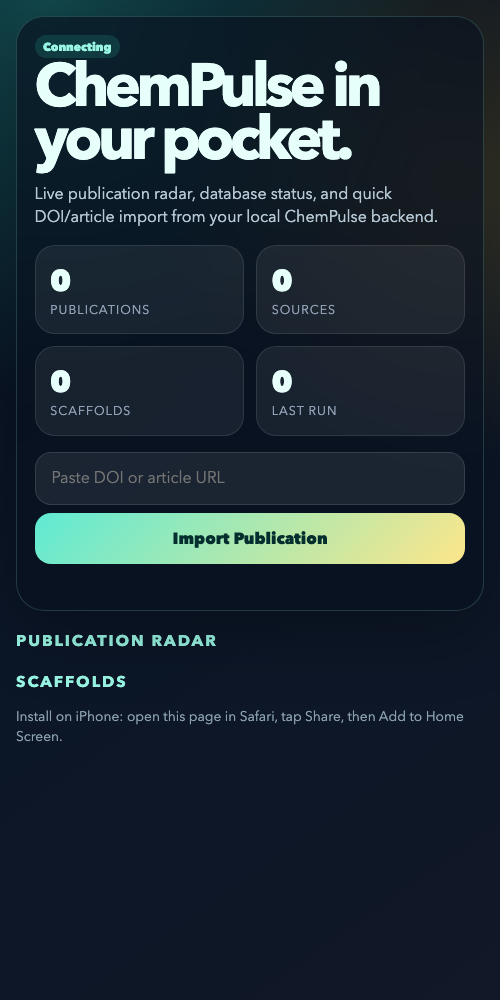

# ChemPulse



ChemPulse is a local-first chemical intelligence product split into a Reflex frontend, a Python backend, and optional desktop/mobile access. It is organized around the application layers needed to run, test, bundle, and ship the product.

## Objective

Build a reviewer-ready chemistry workspace for literature search, scaffold and reaction exploration, evidence-backed mechanism notes, compliant source-pricing workflows, and local data review without depending on a cloud service.

## Stack

- Python, Reflex, Starlette, Uvicorn
- DuckDB-backed local storage and synthetic dataset generation
- RDKit chemistry utilities
- Plotly-ready analytical outputs
- PowerShell/Python packaging scripts for frontend, backend, desktop, and installer workflows

## Key Features

- Local chemical-intelligence UI for topic, structure, reaction, mechanism, report, and pricing workflows.
- Backend APIs for search, data access, reports, plugins, integrations, and chemistry services.
- Mobile companion page for database status, publication radar, and DOI/article import.
- Synthetic 1M-row dataset generator for scale testing without redistributing private data.
- Desktop launcher and build scripts for deployable Windows/macOS-oriented packaging paths.

## How To Review

1. Start with the screenshot above to understand the companion product surface.
2. Review `frontend/ui/assets/chemical_intelligence_markup.html` and `frontend/ui/assets/chemical_intelligence_script.js` for the main chemical-intelligence workspace.
3. Review `backend/chemistry/`, `backend/search/`, `backend/reports/`, and `backend/data/` for the core product logic.
4. Run the verification commands below if you want to check the Python app structure and tests.

## What I Personally Built

- The local-first product architecture across frontend entrypoints, backend services, storage, and desktop/mobile access.
- The chemical-intelligence workflows for literature, structure, reaction, mechanism, report, and source-pricing review.
- The synthetic-data path, packaging scripts, environment handling, and verification checklist needed to evaluate the project as a software product.

## Repository Layout

```text
app.py
backend_app.py
desktop_app.py
rxconfig.py
README.md
backend/
  ai/
  api/
  asgi.py
  chemistry/
  config.py
  core/
  data/
  integrations/
  plugins/
  reports/
  search/
  services/
  tests/
  tools/
  utils/
frontend/
  app/
  desktop/
  state/
  tests/
  tools/
  ui/
requirement/
  base.txt
  backend.txt
  dev.txt
  frontend.txt
```

## What Lives Where

- `frontend/` contains the Reflex app factory, routes, pages, UI components, desktop launcher, and frontend-focused tests.
- `backend/` contains APIs, DuckDB data access, chemistry logic, services, plugins, reports, backend tooling, and backend-focused tests.
- `requirement/` contains split dependency sets.
- `app.py` is the Reflex entrypoint.
- `backend_app.py` is the ASGI backend entrypoint.
- `desktop_app.py` is the desktop launcher entrypoint.
- `rxconfig.py` stays at the repository root because Reflex expects it there.

## Supported Platforms

- Windows: frontend, backend, tests, and desktop packaging are supported.
- macOS: frontend, backend, tests, and desktop runtime are supported.

Writable storage defaults to:

- development: `backend/storage/`
- packaged desktop runtime: the OS app-data directory unless a colocated `backend/storage/` exists

Override storage anywhere with `CHEMPULSE_STORAGE_DIR`.

## Install And Run

### Windows

```powershell
python -m venv .venv
.\.venv\Scripts\Activate.ps1
python -m pip install -r requirement\base.txt -r requirement\frontend.txt -r requirement\backend.txt -r requirement\dev.txt
```

### macOS

```bash
python3 -m venv .venv
source .venv/bin/activate
python -m pip install -r requirement/base.txt -r requirement/frontend.txt -r requirement/backend.txt -r requirement/dev.txt
```

### Full Reflex app

```bash
python -m reflex run
```

This serves the frontend from `app.py` and the API routes registered into the Reflex app.

### Backend-only API

```bash
python -m uvicorn backend_app:app --host 127.0.0.1 --port 8000
```

### Desktop launcher

```bash
python desktop_app.py
```

## Test And Verify

```bash
pytest -q backend/tests frontend/tests
python -m compileall -q app.py backend_app.py desktop_app.py backend frontend
```

The test suite is split by responsibility:

- `backend/tests/`
- `frontend/tests/`

## Synthetic 1M-Row Dataset

Generate the canonical fake dataset with one million rows.

### Windows

```powershell
powershell -ExecutionPolicy Bypass -File backend\tools\generate_test_dataset.ps1
```

### macOS

```bash
python -m backend.data.synthetic_dataset --rows 1000000 --scaffolds 5000 --clusters 240 --publications 120000
```

Default output:

```text
backend/storage/datasets/chempulse-synthetic-1m.duckdb
```

## Build A Deployable Product

### Frontend bundle

Creates a deployable archive containing the frontend runtime, backend support code, root entrypoints, and frontend requirements.

```powershell
powershell -ExecutionPolicy Bypass -File frontend\tools\build_frontend_bundle.ps1
```

Output:

```text
dist/chempulse-frontend.zip
```

### Backend bundle

Creates a deployable archive containing the backend service, backend code, root backend entrypoint, and backend requirements.

```powershell
powershell -ExecutionPolicy Bypass -File backend\tools\build_backend_bundle.ps1
```

Output:

```text
dist/chempulse-backend.zip
```

### Windows desktop package

```powershell
powershell -ExecutionPolicy Bypass -File frontend\tools\build_windows_app.ps1
```

### Windows self-contained installer

```powershell
powershell -ExecutionPolicy Bypass -File frontend\tools\build_self_contained_installer.ps1 -Clean
```

## Environment

Common environment variables:

- `CORE_API_KEY`
- `CHEMPULSE_API_BASE_URL`
- `CHEMPULSE_DEPLOY_URL`
- `CHEMPULSE_STORAGE_DIR`
- `CHEMPULSE_MOBILE_ACCESS_ENABLED`
