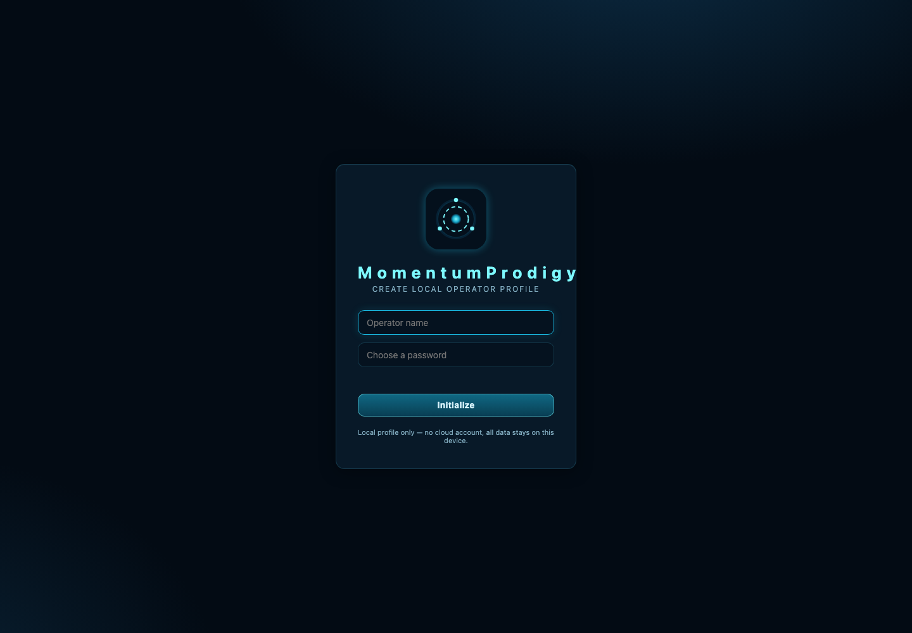

# MomentumProdigy



MomentumProdigy is an offline-first mastery-learning platform for turning
structured course material into guided lessons, adaptive review, searchable
knowledge, and targeted practice. The goal is simple: help learners spend less
time manually making study cards and more time actually mastering the material.

This public repository is organized to look and behave like a real software
project: the product is split into a frontend and backend, the learning logic is
tested, public demo content is safe to inspect, and the code includes
reader-facing commentary for people who are still learning how the system works.

## Objective

Turn structured course material into an offline study system with guided lessons,
adaptive review, local search, tutor-style explanations, and practice generation.

## Stack

- React, TypeScript, Vite, and Vitest
- Local browser storage for profile, settings, progress, review logs, and practice cards
- Node-based content pipeline for course, worksheet, and demo-data generation
- Tauri desktop shell and Capacitor iOS sync path

## Key Features

- A deterministic content pipeline instead of manually maintained cards.
- An original SM-2-family spaced-repetition scheduler.
- Mastery thresholds that unlock lessons based on demonstrated progress.
- Local-only profile, settings, review history, practice cards, and progress.
- Offline search and tutor behavior over bundled course material.
- A React/TypeScript frontend with separated screen styles and product screens.
- Tests for the learning engine, scheduler, storage, search, tutor, and course
  generation.

Runtime learning features do not require network access.

## How To Review

1. Start with the screenshot above to understand the local-first entry flow.
2. Review `backend/src/core/engine.ts`, `backend/src/core/scheduler.ts`, `backend/src/core/mastery.ts`, and `backend/src/core/store.ts` for the learning system.
3. Review `backend/content-pipeline/` for the course and worksheet generation workflow.
4. Review `frontend/src/ui/` and `frontend/src/app/` for the app shell and learner-facing screens.
5. From `frontend/`, run `npm test` and `npm run build` to verify the project.

## What I Personally Built

- The offline-first learning product concept, app shell, visible screens, and local profile/progress behavior.
- The course-generation pipeline, demo content structure, worksheet generation path, and reviewer-safe public content organization.
- The spaced-repetition scheduler, mastery/readiness thresholds, search/tutor behavior, tests, and desktop/mobile packaging paths.

## Repository Layout

```text
MomentumProdigy-GitHub/
├── README.md
├── frontend/
│   ├── index.html
│   ├── package.json
│   ├── public/
│   ├── src/
│   │   ├── app/        # routes, navigation, context, toasts
│   │   ├── styles/     # tokens, layout, shared components, screen CSS
│   │   └── ui/         # app shell and visible screens
│   └── src-tauri/      # desktop shell configuration
└── backend/
    ├── content-pipeline/
    ├── docs/
    ├── models/
    ├── project/
    ├── src/core/
    └── tests/
```

The root intentionally contains only `README.md`, `frontend/`, and `backend/`.
That shallow structure makes the application boundary obvious to reviewers.

## Run And Verify

Requirements: Node.js 18 or newer and npm.

```bash
cd frontend
npm install
npm run generate:demo
npm test
npm run dev
```

Open `http://localhost:5173`. Progress is stored locally on the device.

Useful commands from `frontend/`:

```bash
npm test               # run the Vitest suite
npm run build          # regenerate demo data, type-check, and build
npm run preview        # preview the production web bundle
npm run desktop:dev    # run the Tauri desktop shell (Rust required)
npm run desktop:build  # create a native desktop bundle
npm run ios:sync       # build and sync the Capacitor iOS project
```

## Create a New Learning Module

For public/demo modules:

1. Open `backend/content-pipeline/generate-demo-course.mjs`.
2. Add the new deck, lesson, concept, and card definitions.
3. Use stable, unique IDs so saved progress does not break between builds.
4. Keep explanations, examples, and sources original or redistributable.
5. From `frontend/`, run `npm run generate:demo`.
6. Inspect `frontend/public/course/course.json`.
7. Run `npm test` and `npm run build`.
8. Launch `npm run dev` and verify the module in Library, Review, Search,
   Tutor, and Practice.

For a larger private curriculum, author knowledge under
`backend/content-pipeline/knowledge/`, update the taxonomy and authoring
manifest in `backend/content-pipeline/`, then run `npm run generate:full` from
`frontend/`. Do not publish raw source packets, extracted text, private course
data, or model weights unless you have redistribution rights.

## Create Coding Worksheets

Coding worksheets live in:

```text
backend/content-pipeline/worksheets/
```

Each worksheet is split into learner-controlled chunks. Every chunk has a
prompt, optional starter code, solution code, hints, and source references.
Add new worksheets to the domain file that fits best:

- `powerbi-dax.mjs`
- `python-data.mjs`
- `r-modeling.mjs`
- `analytics-workflow.mjs`
- `optimization.mjs`
- `deep-learning.mjs`
- `spark-genai.mjs`
- `experiments-causal.mjs`

Then generate the app-ready worksheet bundle:

```bash
node backend/content-pipeline/generate-worksheets.mjs

# or, from frontend/
npm run generate:worksheets
```

The generated output is:

```text
frontend/public/worksheets/worksheets.json
```

The current source map is documented in
`backend/docs/WORKSHEET_SOURCE_MAP.md`.

## Mastery Threshold

The default lesson mastery threshold is **90%**.

MomentumProdigy also uses a default **80% review-readiness threshold**, meaning
enough of a lesson’s cards must have graduated into review before the next
lesson unlocks.

Both values live in:

```text
backend/src/core/mastery.ts
```

Change:

- `MASTERY_THRESHOLD` to adjust the 90% mastery requirement.
- `READINESS_THRESHOLD` to adjust the 80% review-readiness requirement.

Use numbers from `0` to `1`; for example, `0.85` means 85%. After changing
either value, run from `frontend/`:

```bash
npm test
npm run build
```

Also update visible wording in the Library and Skill Tree screens if the
defaults change.

## Code Readability

The codebase now includes purpose-level comments above the major functions,
classes, interfaces, constants, and initialization points. These comments are
written to explain significance rather than restating syntax.

Start here if you are new to the code:

- `backend/docs/CODE_READING_GUIDE.md`
- `frontend/src/ui/App.tsx`
- `backend/src/core/engine.ts`
- `backend/src/core/scheduler.ts`
- `backend/src/core/mastery.ts`
- `backend/src/core/store.ts`

## Upload to GitHub

Before publishing:

```bash
cd frontend
npm install
npm test
npm run build
```

Then initialize and push from the project root:

```bash
cd ..
git init
git add README.md frontend backend
git status
git commit -m "Initial public release"
git branch -M main
git remote add origin https://github.com/YOUR-ACCOUNT/YOUR-REPOSITORY.git
git push -u origin main
```

Do not commit `frontend/node_modules/`, `frontend/dist/`, native build output,
raw/private source material, extracted text, local model weights, credentials,
or editor state. See `backend/docs/CLEANUP_RECOMMENDATIONS.md`.

## Further Documentation

- `backend/docs/ARCHITECTURE.md`
- `backend/docs/BUILDING.md`
- `backend/docs/CODE_READING_GUIDE.md`
- `backend/docs/CLEANUP_RECOMMENDATIONS.md`
- `backend/docs/CONTENT_POLICY.md`
- `backend/docs/OFFLINE_AI.md`
- `backend/docs/REPOSITORY_SOP.md`
- `backend/docs/WORKSHEET_SOURCE_MAP.md`
- `backend/docs/USER_GUIDE.md`
- `backend/docs/LIMITATIONS.md`

## License and Contributions

License and contribution guidance live in `backend/project/` so the repository
root remains limited to the required top-level files and folders.
